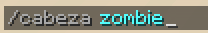
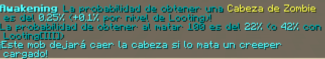
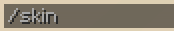
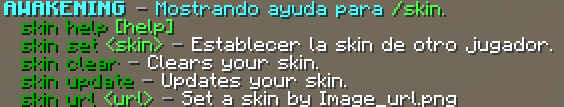
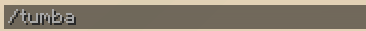
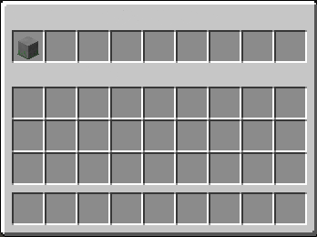
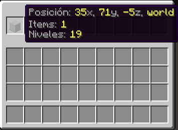
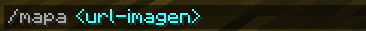

# Comandos

> ### /cabeza
*Añadido en la versión 1.0.1*  
**Permite ver la probabilidad de obtener la cabeza de un mob al matarlo.**
 
 
*Ejemplo:*
 
Entrada:
 

 
Salida:
 

 
 
*Nota: El nombre de la entidad se separa mediante '_', por ejemplo '/cabeza ender_dragon'*

> ### /skin
*Añadido en la versión 1.0.1*  
**Permite cambiar la skin del jugador.**
 
 
*Ejemplo1:*
 
Entrada:
 

 
Salida:
 

 
*Ejemplo2:*
 

> ### /tumba
*Añadido en la versión 1.0.1*  
**Abre un GUI con la posición de las tumbas del jugador.**
 
 
*Ejemplo:*
 
Entrada:
 

 
Salida:
 
‎‎‏‏‎ ‎‏‏‎ ‎‏‏‎ ‎‏‏‎ ‎‏‏‎ ‎‏‏‎ ‎‏‏‎ ‎‏‏‎ ‎‏‏‎ ‎‏‏‎ ‎

> ### /mapa
*Añadido en la versión 1.0.2*  
**El jugador recibe un mapa con la imagen de la url.**
 
 
*Ejemplo:*
 
Entrada:
 

 
Salida:
 
‎‎‏‏‎